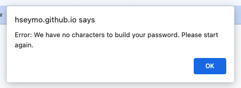

# Random-Password-Generator
LICENSE: [GNU Public License](./LICENSE)

INSTALLATION: Fork this repository and clone it to your local source using git cline commands. 

PACKAGES: None.

DESCRIPTION: 
This is a project that uses JavaScript to build a password generator. I built off HTML, CSS, and Javascript that was provided through the University of Washington Web Development Bootcamp. I solely modified and contributed to the Javascript file. 

The goal of this project is to generate a random password based on user preferences. When the user clicks on the "generate password" button, they are first prompted to input the desired password length, with the criteria that it should be a number between 8 and 128. There is a validity check that ensures their input is an integer and within the range mentioned above. 

Next the user is prompted to answer 'yes' or 'no' to if they want to include: numbers, lowercase letters, capital letters, and/or special characters. There is a validity check to ensure they selected at least one of these options to ensure there is content (a 'bank' of characters) to build the password from.

As prompts are being answered, the funciton builds a character bank based on the desired type(s) of characters.
After all prompts are answered, a function randomizes a password array from the character bank in the length. This uses math floor and math random methods, and generates an array of the desired length by the user. 

The next section of code validates that the password array meets each criteria that the user provided; i.e. if they wanted numbers that the password array will contain a number. If it fails any criteria it re-randomizes and re-checks the criteria. I commented this section of code as "optional" because not all password generators ensure the password returns all desired character types. In fact, By ensuring this we limit the number of potential passwords that may be generated; therefore limiting options. 

Once these 'optional' criteria are met, the password array joins together it's elements and converts to a string. 

Finally our password generator displays the password to the user in the box on the webpage. 

Please check out this project by clicking [here](https://hseymo.github.io/Random-Password-Generator/).

APPLICATION SCREENSHOTS:  
Prompt for character length:

Examples of prompts for character types to include:

Examples of Error Alerts:  

Example final password generation: 

ACKNOWLEDGMENTS: Thank you to University of Washington Web Development Bootcamp for teaching me the skills to create this project as well as providing the starter code. 

QUESTIONS: If you have any questions, please contact me on Github at [hseymo](https://githup.com/hseymo) or by [email](mailto:fake@gmail.com).